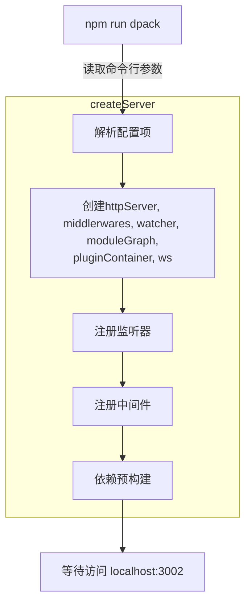

```mermaid
flowchart TB
  Run[npm run dpack] -->|读取命令行参数| RC[解析配置项]
  subgraph createServer
      direction TB
      RC --> CS[创建httpServer, middlerwares, watcher, \n moduleGraph, pluginContainer, ws]
      CS --> Listen[注册监听器]
      Listen --> M[注册中间件]
      M --> O[依赖预构建]
      end
  O --> W[等待访问 localhost:3002]
```
